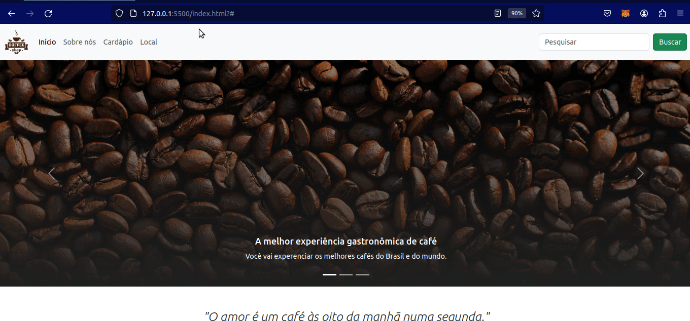

# Coffee Shop - Página Responsiva com Bootstrap

Este repositório faz parte do curso de CSS da [Digital Innovation One (DIO)](https://www.dio.me/). O objetivo é criar uma página para uma cafeteria chamada Coffee Shop, utilizando o framework Bootstrap para garantir responsividade em dispositivos móveis e desktop.



## Sobre a Digital Innovation One (DIO)

A [Digital Innovation One](https://www.dio.me/) é uma plataforma educacional que oferece cursos online e gratuitos em diversas áreas da tecnologia. O curso de CSS fornece conhecimentos essenciais para profissionais de front-end, incluindo o uso de frameworks populares.

## Uso de Frameworks CSS para Profissionais de Front-End

Frameworks de CSS são conjuntos de estilos predefinidos e componentes que facilitam o desenvolvimento de interfaces web. Para profissionais de front-end, o uso de frameworks oferece benefícios como economia de tempo, consistência e a capacidade de criar designs responsivos de forma eficiente.

### Bootstrap e Outros Frameworks CSS

**Bootstrap** é um dos frameworks mais populares, desenvolvido pelo Twitter. Ele oferece uma ampla variedade de componentes, como grids, formulários, botões e muito mais, facilitando a criação de interfaces consistentes e responsivas.

Outros três frameworks CSS conhecidos incluem:

1. **Foundation**: Um framework robusto e altamente personalizável.
2. **Bulma**: Um framework leve baseado em Flexbox.
3. **Materialize**: Implementa o design visual do Material Design do Google.

## Como Replicar este Repositório Localmente

1. Clone o repositório para a sua máquina local:

    ```bash
    git clone https://github.com/igorlnunes/coffeshop
    ```

2. Acesse o diretório do projeto:

    ```bash
    cd coffeshop
    ```

3. Abra o arquivo `index.html` em seu navegador para visualizar a página responsiva da Coffee Shop.

Agora você está pronto para explorar e estudar as técnicas de Bootstrap aplicadas neste projeto!

**Siga codificando!** 🚀